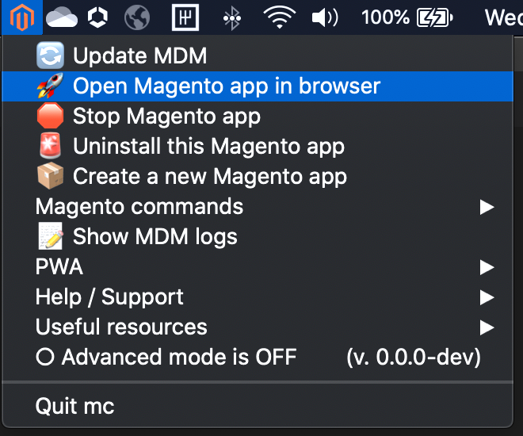
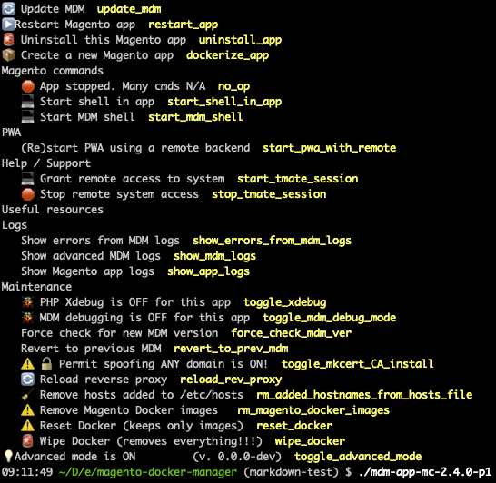

- [Overview](#overview)
- [MDM End Users](#mdm-end-users)
- [MDM Developers](#mdm-developers)
  - [Configuration](#configuration)
  - [Configuration of MDM](#configuration-of-mdm)
  - [Configuration of an MDM app](#configuration-of-an-mdm-app)
  - [Development on a Mac](#development-on-a-mac)
    - [1. clone this repo](#1-clone-this-repo)
    - [2. configure additional features](#2-configure-additional-features)
    - [3. set up your env](#3-set-up-your-env)
  - [Additional troubleshooting notes](#additional-troubleshooting-notes)
  - [Development on Linux](#development-on-linux)
    - [1. add the default user to the docker group](#1-add-the-default-user-to-the-docker-group)
    - [2. clone this repo](#2-clone-this-repo)

# Overview

Screenshots of the MDM UI on a Mac (left) and on any terminal - Mac/Linux/Windows (right).

| OSX Menu App | CLI Menu App
|:-:|:-:|
| ||

Magento Docker Manager (MDM) is a cross platform (Mac/Linux/Windows) application to run multiple, simultaneous Magento
applications on your local system via Docker. Once installed, simply select options from the available menu items to
manage your applications.

MDM's menus are **contextual**. Only applicable options are shown. For example, if a tool is not installed, you will
be prompted to install it before continuing to unlock a feature. If the application is stopped, you'll be prompted it
to start it for additional options.

MDM has 2 general audiences: 
1. End users who might use the Magento app for demos, testing/QA, or training 
2. Developers who want to develop/test locally on a Magento Cloud like env or want to configure a packaged app for
their team of end users

# MDM End Users

End users experience MDM almost entirely through the contextual menus. Below is every possible menu item with some
additional notes if appropiate. If you do not see a particular menu item, then MDM determined it's not currently appropiate.

<!--- start of menu MD generated by markdown-generator-for-menu-items.sh --->

|Top Level Menu Items|   |   |
|:---|:-:|:--|
|▶️ Complete Docker install. Run this.|   |Complete the install by running Docker for the 1st time to reveal more menu items.|
|🔼 Install added tools for more features|   |Highly recommended - includes the magento-cloud CLI, mkcert, tmate, platypus, docker CLI completion|
|🎚 Adjust Docker for min reqs|   |Update the docker vm settings for better performance.|
|▶️ Start Docker to continue|   |Docker is not running. Start it.|
|⚠️ Missing credentials - features limited |[link](https://devdocs.magento.com/guides/v2.4/install-gde/prereq/dev_install.html#instgde-prereq-compose-clone-auth)|MDM can not find your `~/.composer/auth.json` file. You won't be able to create new apps from the source, but a prepackaged app will work. The link to doc shows how to create it.|
|🔄 Update MDM|   |There is a new version of MDM available. Under *Maintenance*, there is an option to revert if needed.|
|🔼 Install & open Magento app|   |   |
|⚠️🔼 Can't install - ports in use.|   |Some local service other than docker is using port 80 or 443.|
|🚀 Open Magento app in browser|   |   |
|🛑 Stop Magento app|   |If not actively being using, stopping the app will free memory.|
|▶️ Restart Magento app|   |   |
|⚠️▶️ Can't restart app - ports in use.|   |   |
|🚨 Uninstall this Magento app|   |If an error occurred during install, this option allows you to try again.|
|🛑 Stop all other Magento apps|   |While multiple Magento apps can run at the same time, it may consume many resources.|
|📦 Create a new Magento app|   |Asks for a Magento Cloud project to recreate locally|
|<nobr>                  </nobr>|<nobr>   </nobr>|   |

<!--- # start Magento commands submenu --->
|Magento commands|   |   |
|:---|:-:|:--|
|🛑 App stopped. Many cmds N/A|   |Start Magento to reveal more options|
|💻 Start shell in app|   |   |
|Reindex|   |   |
|Run cron jobs|   |   |
|Enable all except cms cache|   |   |
|Enable all caches|   |   |
|Flush cache|   |   |
|Warm cache|   |   |
|Pre-generate resized catalog images|   |   |
|Change url for app|   |Use ANY url for your app. Combine with certificate spoofing for better browser compatibility.|
|💻 Start MDM shell|   |*Advanced* See the status of your Docker services|
|<nobr>                  </nobr>|<nobr>   </nobr>|   |
<!--- # end Magento commands submenu --->

|Top Level Menu Items|   |   |
|:---|:-:|:--|
|📝 Show MDM logs|   |*Advanced* Watch the MDM output in realtime. Combine with MDM debugging under *Maintenance*|
|<nobr>                  </nobr>|<nobr>   </nobr>|   |

<!--- # start PWA submenu --->
|PWA|   |   |
|:---|:-:|:--|
|(Re)start PWA using this Magento app|   |The PWA will use the local Magento app as the backend.|
|🛑 App stopped. Start PWA offline|   |   |
|(Re)start PWA using a remote backend|   |   |
|Storystore PWA @ GitHub |[link](https://github.com/PMET-public/storystore-pwa/blob/master/README.md)|   |
|<nobr>                  </nobr>|<nobr>   </nobr>|   |
<!--- # end PWA submenu --->

|Top Level Menu Items|   |   |
|:---|:-:|:--|
|⚠️ Can't run PWA - ports in use.|   |A local service is already using the required ports.|
|<nobr>                  </nobr>|<nobr>   </nobr>|   |

<!--- # start Help / Support submenu --->
|Help / Support|   |   |
|:---|:-:|:--|
|Magento Org #m2-demo-support |[link](slack://channel?team=T016XBMUQLA&id=C018FCG0HHS)|link to slack channel|
|💻 Grant remote access to system|   |Only remote users with pre-authorized keys will be able to connect *1* time. If not configured, a warning appears. Choose if you want to continue and provide the secret url to a remote user.|
|🛑 Stop remote system access|   |   |
|🔓 Grant remote web access|   |If configured, creates a public url able to access this Magenot app.|
|🛑 Stop remote web access; revert url|   |   |
|Magento Community #cloud-docker |[link](slack://channel?team=T4YUW69CM&id=CJ6F3F8NS)|link to slack channel|
|Offical Cloud Support |[link](https://support.magento.com/hc/en-us/requests)|   |
|<nobr>                  </nobr>|<nobr>   </nobr>|   |
<!--- # end Help/Support submenu --->


<!--- # start Useful resources submenu --->
|Useful resources|   |   |
|:---|:-:|:--|
|MDM @ GitHub |[link](https://github.com/pmet-public/mdm)|This project|
|Docker Folder (OneDrive) |[link](https://adobe.sharepoint.com/sites/SITeam/Shared%20Documents/adobe-internal/docker)|   |
|SI Team Home Page (SharePoint) |[link](https://adobe.sharepoint.com/sites/SITeam/SitePages/home.aspx)|   |
|Docker development @ devdocs |[link](https://devdocs.magento.com/cloud/docker/docker-development.html)|The project that MDM builds on to mimic Magento Cloud services|
|Your Magento Cloud Projects |[link](https://demo.magento.cloud/projects/)|   |
|Magento Cloud Chrome Extension |[link](https://github.com/PMET-public/magento-cloud-extension)|   |
|Inside Adobe |[link](https://inside.corp.adobe.com/)|   |
|Field Readiness |[link](https://fieldreadiness-adobe.highspot.com/spots/5cba1d07659e93677419f707)|   |
|<nobr>                  </nobr>|<nobr>   </nobr>|   |
<!--- # end Useful resources submenu --->


<!--- # start logs submenu --->
|Logs|   |*Advanced*|
|:---|:-:|:--|
|Show errors from MDM log|   |Show just the recorded errors|
|Show entire MDM log|   |   |
|Show Magento app logs|   |   |
|<nobr>                  </nobr>|<nobr>   </nobr>|   |
<!--- # end logs submenu --->


<!--- # start maintenance submenu --->
|Maintenance|   |*Advanced*|
|:---|:-:|:--|
|🐞 PHP Xdebug is ON\|OFF for this app|   |Turn on|off php debugging|
|🐞 MDM debugging is ON\|OFF for this app|   |Turn on|off debugging of MDM - much more info written to the logs|
|Force check for new MDM version|   |   |
|Revert to previous MDM|   |   |
|⚠️  🔓 Permit spoofing ANY domain is ON\|OFF!|   |Create TLS certificates that are valid *locally* for any domain. Do not share your local CA!|
|🔄 Reload reverse proxy|   |   |
|🧹 Remove hosts added to /etc/hosts|   |   |
|⚠️  Remove Magento Docker images |   |breaks stopped apps|
|⚠️  Reset Docker (keeps only images)|   |   |
|🚨 Wipe Docker (removes everything!!!)|   |   |
|<nobr>                  </nobr>|<nobr>   </nobr>|   |
<!--- # end maintenance submenu --->

|Top Level Menu Items|   |   |
|:---|:-:|:--|
|💡Advanced mode is ON\|OFF         (v. $v)|   |Show more advanced menu items and display the current version of MDM|
|<nobr>                  </nobr>|<nobr>   </nobr>|   |
<!--- end of menu MD generated by markdown-generator-for-menu-items.sh --->


# MDM Developers

## Configuration

## Configuration of MDM

## Configuration of an MDM app

## Development on a Mac

### 1. clone this repo

```
$ git clone https://github.com/PMET-public/mdm.git && cd mdm
```

### 2. configure additional features

```
cp .mdm_config.tmpl.sh .mdm_config.sh
```

### 3. set up your env

```
$ export debug=1 MDM_REPO_DIR=. COMPOSER_AUTH='{"github-oauth":{"github.com":"..."}}'
```

## Additional troubleshooting notes

To debug the launching script, `export debug_launcher=1`, too. This is currently a separate var because the launching script debugging output would otherwise pollute the menu output before the logging initialization can run. Also, it represents the output of the app's `<osx_appp>/Contents/Resources/script`, not the output of ~/.mdm/current/launcher because it is bundled with the app.  The launcher should not need to be debugged often because it's relatively minimal, stable code to bootstrap the app.

## Development on Linux

Since the included Travis CI and GitHub Workflow configuration use Ubuntu Bionic (18.04) for testing, you will probably also want a local version for faster feedback and debugging.

You can use the default included Vagrantfile. Remember to install the vagrant-diskzie plugin first.

```
$ vagrant plugin install vagrant-disksize
$ vagrant up
$ vagrant ssh
```

In your test vm, there's are just a few remaining setup steps.

### 1. add the default user to the docker group

```
$ sudo apt update && sudo apt upgrade -y
$ sudo apt install docker-compose php -y
$ sudo usermod -aG docker vagrant
$ sudo shutdown -r now
```

### 2. clone this repo

